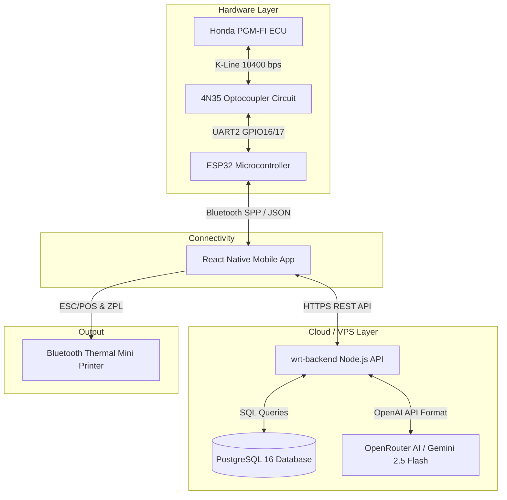

# 🏍️ WRT Garage — Honda PGM-FI AI Diagnostic Tool (v2.0)

[](https://nodejs.org/)
[](https://www.espressif.com/)
[](https://reactnative.dev/)
[](https://www.docker.com/)
[](https://openrouter.ai/)
[](LICENSE)

**WRT Garage** adalah alat diagnosis pintar generasi baru berbasis **AI 3-Layer Engine** dan sistem isolasi hardware optocoupler **4N35 K-Line** untuk sepeda motor Honda PGM-FI (Programmed Fuel Injection).

Sistem ini terdiri dari **3 komponen utama**:
1. **`wrt-backend`**: Service Backend (Node.js, PostgreSQL 16, OpenRouter AI, Docker/Dokploy).
2. **`wrt-firmware`**: Firmware ESP32 FreeRTOS (Fast Init ISO 14230, 5-Baud Init ISO 9141, K-Line driver 4N35, Bluetooth SPP).
3. **`wrt-mobile`**: Aplikasi Mobile React Native dengan UI Glassmorphism Dark Mode & Cetak Struk Thermal Bluetooth (ESC/POS & Zebra ZPL).

---

## 📐 Arsitektur Sistem



---

## 🧠 Engine AI Diagnosis 3-Layer

```
┌────────────────────────────────────────────────────────────┐
│                    AI DIAGNOSIS ENGINE                     │
├────────────────────────────────────────────────────────────┤
│  LAYER 1: RULE ENGINE                                      │
│  - Match 28+ Kode DTC Honda PGM-FI                         │
│  - Lookup nama sensor, fault condition, priority, MIL status│
├────────────────────────────────────────────────────────────┤
│  LAYER 2: KNOWLEDGE BASE                                   │
│  - Analisis 9 sensor realtime (RPM, TPS, MAP, IAT, ECT, O2)│
│  - Validasi threshold idle normal & tabel resistansi NTC   │
│  - Deteksi anomali (mis: IAT = -40°C open circuit)         │
├────────────────────────────────────────────────────────────┤
│  LAYER 3: AI REASONING (OpenRouter)                        │
│  - Model: Google Gemini 2.5 Flash / Claude 3.5 Sonnet      │
│  - Menganalisis korelasi DTC + Live Data + Freeze Frame    │
│  - Menghasilkan ringkasan kondisi, risiko, & estimasi biaya│
└────────────────────────────────────────────────────────────┘
```

---

## 📁 Struktur Repository

```text
coding/
├── wrt-backend/                # Node.js + Express + PostgreSQL + OpenRouter
│   ├── src/
│   │   ├── database/           # PostgreSQL Schema DDL (schema.sql), db.js, migrate.js
│   │   ├── data/               # DTC DB (28 kode), Sensor Specs, ECU DB (28 model)
│   │   ├── services/           # AI Engine (3-Layer), OpenRouter, Receipt, Session
│   │   ├── routes/             # REST Endpoints (/api/ai, /api/dtc-db, /api/motors)
│   │   └── server.js           # Entry point Express Server
│   ├── Dockerfile              # Containerization non-root
│   ├── docker-compose.yml      # Multi-container PostgreSQL + API (Dokploy Ready)
│   └── package.json
│
├── wrt-firmware/               # ESP32 C++ Firmware (Arduino IDE / PlatformIO)
│   ├── wrt_firmware.ino        # Main sketch + FreeRTOS Tasks (BT, Poller, Logger, WDT)
│   ├── config.h                # Pinout GPIO16/17, Baudrate 10400, FreeRTOS stacks
│   ├── ecu_data.h              # Structs (DTC, LiveData, FreezeFrame, Logger sample)
│   ├── kline_driver.h/.cpp     # Fast Init (ISO 14230) + 5-Baud Init (ISO 9141)
│   ├── ecu_manager.h/.cpp      # Honda frame parser, checksum, keep-alive, raw terminal
│   └── ring_buffer.h           # Lock-free ring buffer 500 sampel (~20KB)
│
└── wrt-mobile/                 # React Native Mobile App (iOS & Android)
    ├── android/                # Native Android build project (Gradle 8.5)
    ├── src/
    │   ├── theme/              # Glassmorphism Dark Mode Palette (colors.js)
    │   ├── store/              # Zustand Store (useAppStore.js)
    │   ├── services/           # Bluetooth SPP, Axios API, Thermal ESC/POS & ZPL
    │   └── screens/            # 16 Halaman UI (Dashboard, LiveData, DTC, AIDiagnosis, etc)
    ├── App.js & index.js
    └── package.json
```

---

## 🔌 Rangkaian Hardware K-Line (Optocoupler 4N35)

> **Catatan Penting**: K-Line motor Honda bekerja pada tegangan 12V (battery voltage), sedangkan ESP32 bekerja pada 3.3V logic. Rangkaian optocoupler **4N35** digunakan untuk isolasi total antara sirkuit kelistrikan motor dan mikrokontroler.

```
       HONDA ECU (K-LINE 12V)
               │
          [R_Pullup 510Ω to +12V]
               │
    ┌──────────┴──────────┐
    │                     │
 [4N35 RX Opto]       [4N35 TX Opto]
    │                     │
    ▼                     ▼
ESP32 GPIO16 (RX)    ESP32 GPIO17 (TX)
```

---

## 🛠️ Cara Memulai & Quick Start

### 1. Backend API (Dokploy / Docker VPS)
> 📄 **Panduan Lengkap Deploy Dokploy**: Lihat dokumen [DOKPLOY_DEPLOYMENT.md](file:///c:/Users/A%20D%20M%20I%20N/Downloads/coding/wrt-backend/DOKPLOY_DEPLOYMENT.md)

```bash
cd wrt-backend
cp .env.example .env
# Edit .env: Isikan OPENROUTER_API_KEY Anda
docker-compose up -d --build
```
- Server API berjalan di: `http://localhost:3000`
- Health check: `GET http://localhost:3000/api/health`

### 2. ESP32 Firmware (Arduino IDE)
1. Buka Arduino IDE.
2. Buka file [`wrt-firmware/wrt_firmware.ino`](file:///c:/Users/A%20D%20M%20I%20N/Downloads/coding/wrt-firmware/wrt_firmware.ino).
3. Pilih Board: **ESP32 Dev Module**.
4. Hubungkan ESP32 via USB dan tekan **Upload**.

### 3. Mobile App (React Native)
```bash
cd wrt-mobile
npm install
npx react-native run-android
```

---

## 🏍️ Database ECU Honda Terverifikasi

| Model Motor | Kode Model | Tahun | ECU Part Number | Produsen ECU | Protokol & Init |
|-------------|------------|-------|-----------------|--------------|-----------------|
| BeAT FI (Gen 1) | K25 | 2012–2014 | `38770-K25-901` | Keihin | K-Line (Fast Init) |
| BeAT eSP | K81 | 2014–2019 | `30400-K81-N01` | Shindengen | K-Line (Fast Init) |
| BeAT Deluxe / Genio | K1A | 2020+ | `30400-K1A-N01` | Shindengen | K-Line (Fast Init) |
| Scoopy FI (Gen 1) | K16G | 2013–2015 | `38770-K25-901` | Keihin | K-Line (Fast Init) |
| Scoopy eSP | K93 | 2017–2022 | `30400-K93-N01` | Shindengen | K-Line (Fast Init) |
| Vario 125 eSP (LED) | K60 | 2015–2022 | `30400-K60-901` | Shindengen | K-Line (Fast Init) |
| Vario 150 eSP | K59 | 2015–2022 | `30400-K59-A11` | Shindengen | K-Line (Fast Init) |
| Vario 160 eSP+ | K2S | 2022+ | `30400-K2S-N01` | Shindengen | K-Line (Fast Init) |
| PCX 150 (Lokal) | K97 | 2014–2020 | `30400-K97-N01` | Shindengen | K-Line (Fast Init) |
| PCX 160 eSP+ | K1Z | 2021+ | `30400-K1Z-N01` | Shindengen | K-Line (Fast Init) |
| CB150R StreetFire | K15 | 2012–2014 | `38770-K15-903` | Keihin | K-Line (Fast Init) |
| Sonic 150R | K56 | 2015+ | `38770-K56-N01` | Keihin | K-Line (Fast Init) |
| Supra X 125 FI (Gen 1) | KPH | 2007–2013 | `38770-KPH-881` | Keihin | K-Line (5-Baud Init) |

---

## 📡 API Endpoint Reference

| Method | Endpoint | Deskripsi | Auth |
|--------|----------|-----------|------|
| `GET` | `/api/health` | Service uptime & status check | Public |
| `GET` | `/api/dtc-db` | List seluruh database DTC Honda | Public |
| `GET` | `/api/dtc-db/:code` | Lookup detail kode DTC spesifik | Public |
| `GET` | `/api/motors` | List model & ECU part number Honda | Public |
| `POST` | `/api/ai/diagnose` | Run 3-Layer AI Diagnosis Engine | Required |
| `POST` | `/api/ai/chat` | Chat bebas dengan WRT AI Assistant | Required |
| `POST` | `/api/sessions` | Buat service session baru | Required |
| `POST` | `/api/feedback` | Rating & feedback hasil AI (1-5 star) | Required |

---

## 📜 Lisensi & Hak Cipta

Pengembangan oleh **WRT Garage Team** © 2026. Distributed under the MIT License.
