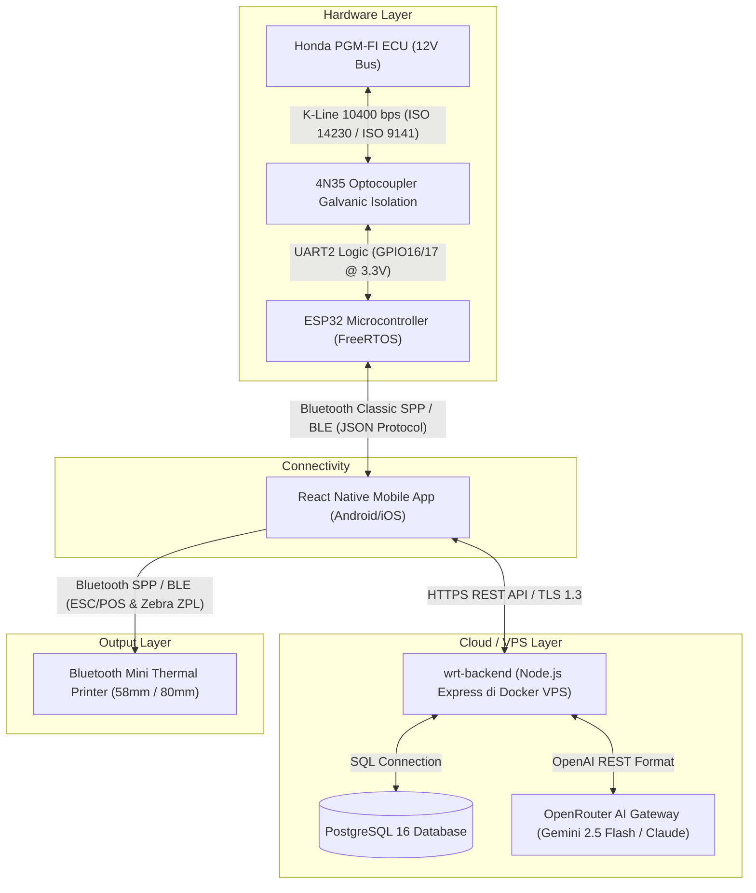

# 🏍️ WRT Garage — Honda PGM-FI AI Diagnostic Tool (v2.0)

[](https://nodejs.org/)
[](https://www.espressif.com/)
[](https://reactnative.dev/)
[](https://www.docker.com/)
[](https://openrouter.ai/)
[](https://www.postgresql.org/)
[](LICENSE)

> **Tagline**: *"Diagnosis Honda seperti Master Teknisi — di genggaman tangan, dengan kecerdasan AI"*

**WRT Garage** adalah ekosistem alat diagnostik pintar generasi baru berbasis **AI 3-Layer Engine** dan sirkuit proteksi isolasi optocoupler **4N35 K-Line** untuk seluruh lini sepeda motor Honda PGM-FI (Programmed Fuel Injection). Sistem ini mengintegrasikan mikrokontroler ESP32, aplikasi mobile smartphone (Android/iOS), backend cloud berbasis Docker di VPS, printer struk thermal Bluetooth, serta model penalaran Large Language Model (LLM) mutakhir (Google Gemini 2.5 Flash / Claude 3.5 Sonnet melalui OpenRouter).

---

## 📖 Latar Belakang

Sistem **Honda PGM-FI (Programmed Fuel Injection)** telah menjadi standar sistem injeksi bahan bakar untuk puluhan juta sepeda motor Honda modern di Indonesia dan Asia Tenggara — mencakup lini harian seperti BeAT, Scoopy, Genio, Vario 125/160, PCX 150/160, ADV, hingga kategori bebek super dan sport seperti Supra X 125, Supra GTR, Sonic 150R, CB150R, dan CBR150R/250RR. 

Setiap unit motor ini dibekali **ECU (Engine Control Unit)** yang secara terus-menerus memantau kesehatan mesin, membaca input belasan sensor elektrikal, serta menyimpan kode gangguan (*Diagnostic Trouble Code / DTC*) dan *Freeze Frame*. Namun, selama bertahun-tahun, akses data komprehensif dari ECU tersebut **terkunci di balik alat scanner khusus pabrikan (*Honda HDS - Honda Diagnostic System*)** yang memiliki banderol harga fantastis (mencapai puluhan juta rupiah), berdimensi besar, dan mewajibkan penggunaan laptop di bengkel.

Kondisi tersebut melahirkan **kesenjangan teknologi yang teramat lebar** antara bengkel resmi jaringan APM dan ratusan ribu bengkel umum, bengkel UMKM pinggir jalan, mekanik independen, penghobi (*hobbyist/tuner* balap), serta para pelajar di Sekolah Menengah Kejuruan (SMK) Otomotif di seluruh pelosok negeri.

---

## ⚠️ Masalah & Solusi

### 1. Masalah Utama Mekanik & Bengkel Saat Ini

| No | Masalah Nyata di Lapangan | Dampak Negatif |
|:--:|---|---|
| **1** | **Biaya Scanner Pabrikan Sangat Mahal**<br>Alat resmi Honda HDS berharga > Rp 50.000.000, sedangkan scanner OBD2 mobil murah umumnya tidak kompatibel dengan protokol khusus K-Line Honda (10400 bps). | Bengkel kecil dan mekanik mandiri tidak sanggup membeli alat, sehingga terpaksa mendiagnosis motor hanya bermodalkan "feeling" dan tebak-tebakan. |
| **2** | **Diagnosis Tanpa Pemahaman Konteks Data**<br>Alat baca murah (jika ada) hanya menampilkan kode error mentah (misal: `P0113`) tanpa analisis korelasi sensor lainnya. | Salah vonis dan salah ganti sparepart mahal (misal ganti ECU atau ganti sensor baru), padahal masalahnya hanya konektor kotor atau kabel putus. Konsumen dirugikan. |
| **3** | **Ketiadaan Pemantauan Live Sensor Real-Time**<br>Mekanik kesulitan memantau respon tegangan sensor saat mesin menyala, idle, atau digas. | Kerusakan *intermittent* (gejala brebet atau hilang tenaga yang timbul-tenggelam saat jalan) menjadi sangat sulit dilacak dan memakan waktu berhari-hari. |
| **4** | **Data Freeze Frame Terabaikan**<br>Data kondisi sensor pada detik persis saat lampu indikator MIL menyala tidak pernah dibaca. | Konteks pemicu kerusakan hilang, mempersulit penentuan apakah masalah terjadi karena mesin overheat, tegangan drop, atau korsleting mendadak. |
| **5** | **Mekanik Pemula & Siswa SMK Minim Mentoring**<br>Belajar sistem injeksi motor modern memerlukan jam terbang tinggi untuk memahami makna angka resistansi, voltase, dan sinyal sensor. | Kesalahan diagnosis berulang kali, kualitas servis tidak konsisten, dan praktikum otomotif di sekolah kejuruan berjalan tanpa alat peraga interaktif. |
| **6** | **Ketiadaan Riwayat Servis Digital & Bukti Fisik**<br>Laporan kerusakan hanya disampaikan secara lisan tanpa bukti cetak formal. | Konsumen bengkel sering merasa ragu/curiga terhadap kejujuran bengkel, dan riwayat kesehatan motor hilang saat servis berikutnya. |

---

### 2. Solusi Komprehensif dari WRT Garage

Untuk mengatasi permasalahan di atas, **WRT Garage** menghadirkan solusi teknologi terpadu yang memadukan keandalan perangkat keras nirkabel dengan kedalaman analisis *Artificial Intelligence*:

1. **Hardware Diagnostik Mandiri Ultra-Terjangkau**: Menggunakan mikrokontroler ESP32 dual-core yang dipadukan dengan sirkuit isolasi optocoupler 4N35 untuk bus K-Line 12V. Biaya pembuatan perangkat hanya berkisar **Rp 150.000 – Rp 300.000**, memberikan kemampuan pembacaan ECU setara scanner resmi bernilai puluhan juta rupiah.
2. **AI Diagnosis Engine 3-Layer**: Menggabungkan *Layer 1 (Rule Engine Honda DTC)*, *Layer 2 (Knowledge Base Sensor & Threshold Honda)*, dan *Layer 3 (AI Reasoning LLM OpenRouter/Gemini 2.5 Flash)*. AI bertindak layaknya seorang *Master Technician* Honda berpengalaman 20 tahun yang menganalisis korelasi data secara holistik.
3. **Pemantauan Real-Time di Layar Smartphone**: Mengirimkan streaming 14+ sensor mesin secara nirkabel via Bluetooth (SPP/BLE) ke aplikasi mobile smartphone (React Native) dengan visualisasi grafik responsif berkecepatan tinggi (≥ 5 Hz).
4. **Pencetakan Bukti Struk Fisik Thermal Printer**: Mengintegrasikan protokol pencetakan ESC/POS & Zebra ZPL ke printer thermal mini Bluetooth. Mekanik dapat mencetak struk hasil diagnosis langsung di depan pemilik motor, lengkap dengan ringkasan status sensor, tingkat risiko, langkah perbaikan, estimasi biaya sparepart, serta QR code menuju laporan digital.
5. **Pencatatan Servis Terpusat di Cloud (Docker & PostgreSQL)**: Menyimpan riwayat servis motor, kode kerusakan lama yang pernah terhapus, data freeze frame, dan catatan mekanik secara rapi di database cloud VPS untuk perawatan preventif di masa depan.

---

## 🎯 Goals & Sasaran Produk

### 1. Functional Goals (Sasaran Fungsional)
- **Komunikasi Dua Arah ECU**: Melakukan inisialisasi handshaking (*Fast Init ISO 14230* dan *5-Baud Init ISO 9141*) dengan ECU Honda pada baudrate 10400 bps secara stabil.
- **DTC Management**: Membaca kode kesalahan aktif (*Active*) maupun tersimpan (*Pending*), serta menghapus fault memory (*Clear DTC*) untuk mematikan lampu indikator MIL setelah perbaikan selesai.
- **Multi-Sensor Live Streaming**: Membaca dan menampilkan 14+ parameter sensor mesin secara simultan (RPM, TPS, MAP, IAT, ECT, O2 Sensor, Voltase Aki, IACV, Fuel Trim, Kecepatan, dsb).
- **Snapshot Freeze Frame**: Mengekstrak data riwayat sensor pada saat kode kegagalan pertama kali tercatat oleh memori non-volatile ECU.
- **AI-Powered Root Cause & Action Plan**: Menghasilkan rekomendasi penyebab utama, confidence score, langkah perbaikan terurut (*check steps*), dan estimasi biaya sparepart dalam mata uang Rupiah (IDR).
- **Interactive AI Chat Assistant**: Menyediakan dialog konsultasi bebas mekanik dengan AI Assistant mengenai kendala motor dengan membawa konteks data motor yang sedang diperiksa.
- **Data Logger & Export CSV**: Merekam telemetri sensor saat motor diuji jalan (*road test* atau *track day racing*) ke dalam *ring buffer* memori lokal untuk diekspor ke file CSV.
- **Physical Thermal Receipt Printing**: Menghasilkan struk fisik profesional pada kertas thermal 58mm atau 80mm via koneksi Bluetooth nirkabel.
- **Manual HEX Terminal**: Menyediakan konsol raw byte untuk pengujian perintah diagnostik tingkat lanjut bagi tuner atau teknisi senior.
- **Over-The-Air (OTA) Update**: Memungkinkan pembaruan firmware ESP32 secara nirkabel tanpa perlu membongkar modul atau menyambungkan kabel USB.

### 2. Business & Impact Goals (Sasaran Bisnis & Dampak)
- **Demokratisasi Teknologi Injeksi**: Membuka akses diagnosis ECU berstandar pabrikan bagi seluruh bengkel UMKM, mekanik mandiri, dan SMK Otomotif dengan biaya terjangkau.
- **Efisiensi Waktu Servis**: Memangkas waktu diagnosis kerusakan kelistrikan dan injeksi motor dari rata-rata 45–90 menit menjadi **di bawah 5 menit**.
- **Pengurangan Kesalahan Pergantian Komponen**: Menekan angka salah ganti sparepart yang tidak perlu hingga **lebih dari 30% per bulan**.
- **Transparansi & Kepuasan Pelanggan**: Meningkatkan indeks kepercayaan pelanggan bengkel (*Customer Satisfaction Score > 4.5/5.0*) melalui bukti struk diagnosis transparan dan terstandarisasi.
- **Peluang Monetisasi**: Menyediakan model bisnis berkelanjutan berbasis langganan API AI query (*SaaS Subscription / Credit Quota*) untuk bengkel komersial.

### 3. Technical Goals (Sasaran Teknis)
- **ECU Handshake Latency**: Waktu inisialisasi koneksi K-Line hingga respons pertama ECU **< 3 detik** (*Fast Init mode*).
- **Telemetry Streaming Rate**: Pembaruan data live sensor mencapai **≥ 5 Hz** (minimal 5 sampel per detik) tanpa buffer lag.
- **AI Reasoning Response Time**: Latensi respons diagnosis AI dari backend cloud **< 5 detik (p95)** melalui optimasi prompt JSON.
- **System Stability & Reliability**: Uptime firmware ESP32 mencapai **> 99%** dengan proteksi *Hardware Task Watchdog Timer (WDT)* dan *error recovery auto-reconnect*.
- **AI Diagnostic Accuracy**: Tingkat akurasi identifikasi akar penyebab kerusakan mencapai **> 85%** jika dibandingkan dengan *ground truth* Teknisi Master Honda.

---

## 🚀 Katalog Lengkap Fitur & Cara Kerja

Berikut adalah rincian fungsionalitas dan mekanisme operasional dari setiap fitur yang ada di ekosistem **WRT Garage**:

```
┌────────────────────────────────────────────────────────────────────────────┐
│                       FITUR LENGKAP WRT GARAGE v2.0                        │
├────────────────────────────────┬───────────────────────────────────────────┤
│ 1. Pembacaan DTC & Status MIL  │ 8. Cetak Struk Thermal (ESC/POS & ZPL)    │
│ 2. Clear / Reset DTC           │ 9. Manual K-Line HEX Terminal             │
│ 3. Real-Time Live Sensor (14+) │ 10. Sensor Actuation Test                 │
│ 4. Freeze Frame Diagnostics    │ 11. Identifikasi ECU & Nomor Part         │
│ 5. 3-Layer AI Diagnostic Engine│ 12. Riwayat Servis & Database Cloud       │
│ 6. Asisten Konsultasi AI Chat  │ 13. Over-The-Air (OTA) Firmware Update    │
│ 7. Data Logger & Ekspor CSV    │ 14. Proteksi Isolasi Optocoupler 4N35     │
└────────────────────────────────┴───────────────────────────────────────────┘
```

---

### 1. Pembacaan DTC (Diagnostic Trouble Code) & Status MIL
* **Deskripsi**: Fitur untuk membaca seluruh daftar kode kerusakan yang tersimpan di dalam memori ECU Honda PGM-FI, baik kode aktif (*current fault*) yang sedang menyalakan lampu MIL maupun kode masa lalu (*pending/historical fault*).
* **Cara Kerja**:
  1. Aplikasi mobile mengirimkan instruksi pembacaan DTC melalui Bluetooth SPP ke ESP32.
  2. ESP32 merangkai paket frame K-Line Honda (Mode diagnostik baca memori error) lengkap dengan *header*, panjang data, kode perintah, dan *checksum* bitwise.
  3. Frame dikirimkan ke pin K-Line motor pada kecepatan 10400 bps.
  4. ECU merespons dengan frame data berisi kumpulan byte kode DTC yang tersimpan.
  5. ESP32 mem-parsing byte tersebut, memverifikasi *checksum*, dan mengirimkan daftar kode DTC ke smartphone.
  6. Aplikasi mobile melakukan pencocokan dengan database internal untuk menampilkan nama resmi sensor, kondisi kegagalan (*fault condition*), tingkat keparahan, serta status lampu MIL di speedometer motor.

---

### 2. Clear / Reset DTC & Reset Indikator MIL
* **Deskripsi**: Fitur untuk menghapus riwayat kode kegagalan dari memori non-volatile ECU setelah perbaikan mekanik selesai dilakukan, serta memadamkan lampu indikator MIL pada dashboard motor.
* **Cara Kerja**:
  1. Mekanik menekan tombol **"Hapus Kode DTC"** pada antarmuka aplikasi mobile setelah perbaikan fisik selesai.
  2. Aplikasi mengirimkan sinyal perintah konfirmasi reset ke ESP32.
  3. ESP32 mengirimkan frame instruksi khusus *Clear Fault Memory* ke bus K-Line ECU.
  4. ECU memproses perintah, mengosongkan tabel register error internal, mematikan indikator MIL, dan mengembalikan byte konfirmasi status (*Acknowledge / ACK*).
  5. ESP32 secara otomatis memicu pembacaan ulang DTC (*verification pass*) untuk memastikan bahwa semua kode benar-benar telah terhapus dan sistem bersih tanpa error baru.

---

### 3. Real-Time Live Sensor Monitoring (14+ Parameter Mesin)
* **Deskripsi**: Fitur pemantauan telemetri data sensor mesin secara langsung (*real-time*) saat kontak menyala ataupun saat mesin dihidupkan (idle, akselerasi, dan deselerasi).
* **Parameter yang Dipantau**: Putaran Mesin (RPM), Sudut Bukaan Throttle (TPS Volt & Derajat), Tekanan Intake Manifold (MAP kPa), Suhu Udara Masuk (IAT °C), Suhu Air Pendingin/Oli (ECT °C), Tegangan Sensor Oksigen (O2 Sensor Volt), Tegangan Baterai/Aki (VB Volt), Posisi Katup Idle (IACV %), Fuel Trim (%), Kecepatan Roda (Speed km/h), dsb.
* **Cara Kerja**:
  1. Task khusus `ECU Poller` di sistem operasi FreeRTOS ESP32 berjalan secara independen dengan siklus *polling* setiap **200 milidetik (5 Hz)**.
  2. ESP32 secara berkala meminta paket data sensor (*Live Data Table Frame*) dari ECU melalui K-Line.
  3. Data mentah (*raw bytes*) dikonversi menggunakan formula transfer function karakteristik sensor Honda (misal: konversi nilai analog-to-digital menjadi derajat Celcius berdasarkan kurva NTC).
  4. Data yang telah diformat dimasukkan ke dalam antrean (*queue*) dan ditransmisikan via Bluetooth SPP/WebSocket ke aplikasi mobile.
  5. UI aplikasi mobile merender data sensor dalam bentuk kartu parameter interaktif, progress bar warna dinamis (hijau jika normal, merah jika berada di luar batas toleransi), serta grafik gelombang real-time.

---

### 4. Freeze Frame Data Capture
* **Deskripsi**: Fitur untuk menangkap "rekaman hitam" (*black-box snapshot*) yang merekam parameter kerja seluruh sensor pada detik persis ketika sebuah DTC pertama kali terdeteksi dan memicu lampu MIL menyala.
* **Cara Kerja**:
  1. Ketika mendeteksi adanya DTC aktif pada ECU, ESP32 mengirimkan request query frame *Freeze Frame Data* ke alamat memori histori ECU.
  2. ECU mengirimkan kembali blok data statis yang berisi kondisi mesin pada saat error terjadi (misal: RPM mesin saat kejadian, suhu ECT, posisi bukaan gas, dan beban mesin).
  3. Aplikasi mobile membandingkan nilai parameter saat kejadian dengan batas toleransi normal pada kondisi operasional mesin saat ini.
  4. Data freeze frame ini kemudian dijadikan salah satu masukan penting bagi AI Engine untuk membedakan apakah gangguan terjadi akibat faktor sesaat (seperti guncangan soket kabel atau genangan air hujan) atau kerusakan internal permanen pada komponen.

---

### 5. Engine AI Diagnosis 3-Layer
* **Deskripsi**: Otak kecerdasan buatan terpadu yang memadukan penalaran deterministik dan model generatif LLM mutakhir (*Google Gemini 2.5 Flash / Claude 3.5 Sonnet melalui OpenRouter API*) untuk menganalisis akar penyebab masalah motor, tingkat risiko keselamatan, langkah penanganan teknis bertahap, dan estimasi biaya perbaikan.
* **Cara Kerja**:

```
┌────────────────────────────────────────────────────────────┐
│                    AI DIAGNOSIS ENGINE                     │
├────────────────────────────────────────────────────────────┤
│  LAYER 1: RULE ENGINE                                      │
│  - Pencocokan 200+ Kode DTC Honda PGM-FI                   │
│  - Lookup nama sensor, sirkuit, prioritas, & status MIL   │
├────────────────────────────────────────────────────────────┤
│  LAYER 2: KNOWLEDGE BASE                                   │
│  - Validasi threshold normal (idle, suhu kerja, voltase)   │
│  - Deteksi anomali (misal: IAT = -40°C open circuit)      │
│  - Analisis kurva toleransi resistansi termistor NTC       │
├────────────────────────────────────────────────────────────┤
│  LAYER 3: AI REASONING (OpenRouter / Gemini 2.5 Flash)     │
│  - Menganalisis korelasi DTC + Live Data + Freeze Frame    │
│  - Menghasilkan ringkasan kondisi, risiko, & confidence    │
│  - Menyusun urutan langkah inspeksi mekanik (check steps)  │
│  - Menghitung perkiraan harga sparepart & jasa dalam IDR   │
└────────────────────────────────────────────────────────────┘
```

  1. **Layer 1 (Rule Engine)**: Backend menerima request dari mobile app, mengekstrak kode DTC, lalu mencocokkannya ke database DTC Honda untuk mengambil definisi sirkuit, sistem yang terpengaruh, dan prioritas kode.
  2. **Layer 2 (Knowledge Base)**: Backend memvalidasi data live sensor terhadap standar toleransi operasional mesin Honda PGM-FI. Jika ditemukan nilai ekstrem (misal IAT bernilai -40°C sementara ECT 92°C), Layer 2 menandai anomali ini sebagai *open circuit / kabel putus*, bukan kerusakan ECU.
  3. **Layer 3 (AI Reasoning)**: Seluruh temuan dari Layer 1 dan Layer 2, ditambah dengan data freeze frame, identitas motor, kilometer tempuh, serta keluhan pengguna dirangkum ke dalam satu format terstruktur (*JSON Prompt*). Prompt tersebut dikirimkan ke model AI via OpenRouter API.
  4. Model AI mengembalikan respons JSON terstruktur yang berisi:
     - **Ringkasan Analisis Singkat**: Penjelasan lugas tanpa istilah yang berbelit.
     - **Tingkat Risiko**: `low`, `medium`, `high`, atau `critical`.
     - **Penyebab Utama & Alternatif**: Dilengkapi persentase confidence score dan bukti pendukung (*evidence*).
     - **Langkah Pengecekan Terurut (*Check Steps*)**: Urutan aksi mulai dari yang paling mudah (inspeksi soket, semprot contact cleaner) hingga yang membutuhkan alat ukur (multimeter) atau penggantian part.
     - **Estimasi Biaya Part**: Kisaran harga resmi dan aftermarket sparepart Honda di pasar Indonesia.

---

### 6. Asisten Konsultasi AI Interaktif (AI Chat Assistant)
* **Deskripsi**: Fitur obrolan konsultasi mekanik interaktif di aplikasi mobile untuk bertanya jawab mengenai problem motor yang tidak biasa, panduan bongkar-pasang komponen injeksi, atau tips penyetelan mesin.
* **Cara Kerja**:
  1. Mekanik mengetikkan pertanyaan pada ruang obrolan (*chat screen*) aplikasi mobile.
  2. Aplikasi menyertakan status motor saat ini (kode DTC yang sedang terdeteksi dan nilai sensor terkini) sebagai *context prompt*.
  3. Backend mengirimkan percakapan ke model LLM dengan persona *Honda Master Technician*.
  4. AI membalas dalam bahasa Indonesia yang praktis, aplikatif, dan langsung mengarah ke solusi teknis di lapangan.

---

### 7. Data Logger & Ekspor CSV (Mode Racing & Uji Jalan)
* **Deskripsi**: Fitur perekaman telemetri seluruh sensor mesin secara kontinu selama sesi uji jalan (*road test*) atau latihan sirkuit balap (*track day*) tanpa memerlukan koneksi internet aktif.
* **Cara Kerja**:
  1. Mekanik mengaktifkan mode **"Mulai Merekam"** pada aplikasi sebelum motor dijalankan.
  2. FreeRTOS Core 0 pada ESP32 merekam 10 parameter sensor setiap 200ms ke dalam struktur memori *Lock-Free Ring Buffer* berkapasitas 500 sampel (~20 KB RAM) tanpa menggunakan alokasi dinamis (*zero malloc*) untuk mencegah *memory fragmentation*.
  3. Data yang terkumpul ditulis secara berkala ke partisi flash internal (*LittleFS*).
  4. Setelah sesi uji selesai, data telemetri diunduh ke smartphone dan diekspor menjadi file `.CSV` yang dapat dibuka di spreadsheet (Excel/Google Sheets) atau dianalisis lebih lanjut menggunakan software telemetri balap.

---

### 8. Cetak Struk Hasil Diagnosis (Mini Thermal Printer ESC/POS & Zebra ZPL)
* **Deskripsi**: Fitur untuk mencetak laporan hasil pemeriksaan diagnostik motor dan rekomendasi AI secara instan ke printer thermal mini portabel via Bluetooth sebagai dokumen bukti fisik untuk pelanggan bengkel.
* **Cara Kerja**:
  1. Setelah hasil diagnosis AI keluar di smartphone, mekanik menekan tombol **"Cetak Struk"**.
  2. Aplikasi mobile mengelola **koneksi Bluetooth ganda (*Dual Channel Bluetooth*)**: satu saluran terhubung ke modul ESP32, dan saluran kedua terhubung ke printer thermal mini.
  3. Aplikasi mendeteksi tipe printer yang digunakan:
     - **Printer Thermal Standar (58mm / 80mm)**: Dikonversi menjadi *byte stream command* **ESC/POS** (pengaturan alignment tengah, font tebal/bold, feed paper, dan pemotongan kertas).
     - **Printer Industri Portabel Zebra**: Dikonversi menjadi kode label **Zebra ZPL II**.
  4. Data yang dicetak mencakup: Identitas Motor, Nomor Polisi, Part Number ECU, Daftar Kode DTC, Status Live Sensor, Rekomendasi AI & Estimasi Biaya, serta **QR Code Laporan Digital**.
  5. Perintah dikirim via Bluetooth SPP/BLE dan dicetak dalam hitungan detik.

---

### 9. Manual K-Line Terminal (Mode Raw HEX Command)
* **Deskripsi**: Konsol terminal diagnostik tingkat lanjut untuk mekanik profesional, tuner ECU, atau peneliti otomotif yang ingin mengirimkan paket *byte* heksadesimal mentah secara langsung ke ECU motor.
* **Cara Kerja**:
  1. Pengguna memasukkan string perintah heksadesimal (misal: `72 05 71 00 18`) pada layar Terminal aplikasi mobile.
  2. Data dikirimkan ke ESP32 melalui koneksi serial Bluetooth.
  3. Firmware ESP32 menghitung *checksum* byte (penjumlahan komplementer heksadesimal) secara otomatis jika belum disertakan, lalu mentransmisikannya ke bus K-Line via sirkuit optocoupler 4N35.
  4. Setiap byte pantulan (*echo*) dan respons balasan dari ECU ditangkap oleh pin UART2 RX ESP32 dan dikirimkan kembali ke smartphone untuk ditampilkan dalam antarmuka monitor heksadesimal (*Hex Monitor View*).

---

### 10. Sensor Actuation Test (Pengujian Komponen Aktif)
* **Deskripsi**: Fitur pengujian aktif yang memerintahkan ECU untuk menyalakan aktuator tertentu (injektor bensin, koil pengapian, solenoid IACV/idle valve, atau pompa bahan bakar) guna memverifikasi kondisi mekanikal dan kelistrikan komponen secara langsung tanpa perlu membongkar bodi motor.
* **Cara Kerja**:
  1. Mekanik memilih aktuator yang ingin diuji pada menu *Sensor Test* di aplikasi.
  2. ESP32 mengirimkan kode perintah diagnostik aktuasi spesifik (*Actuator Test Routine Command*) ke ECU melalui K-Line.
  3. ECU mengaktifkan transistor driver output komponen tersebut selama durasi tertentu (misal: memantik koil busi sebanyak 5 kali atau membuka-tutup injektor selama 3 detik).
  4. Mekanik mendengarkan atau mengamati respons fisik komponen (seperti bunyi klik injektor atau percikan api busi) untuk memastikan apakah jalur suplai arus dan aktuator bekerja dengan baik.

---

### 11. Informasi ECU & Identifikasi Kendaraan (ECU Identification & VIN)
* **Deskripsi**: Fitur untuk membaca nomor part resmi ECU (*ECU Part Number*), varian hardware, versi software/firmware internal, serta nomor identifikasi kendaraan (VIN) yang terprogram di dalam memori ROM ECU.
* **Cara Kerja**:
  1. Sesaat setelah inisialisasi koneksi awal berhasil, ESP32 mengirimkan perintah *Read ECU Identification Service* ke K-Line.
  2. ECU merespons dengan kumpulan karakter ASCII yang merepresentasikan nomor part resmi pabrikan (misal: `38770-K1Z-B01` untuk PCX 160 atau `38770-K25-901` untuk BeAT FI).
  3. Aplikasi mencocokkan nomor part tersebut dengan database motor terverifikasi pada backend untuk secara otomatis mengidentifikasi tipe motor, tipe pengapian, dan spesifikasi pabrikan tanpa mekanik harus memilih tipe motor secara manual.

---

### 12. Riwayat Servis Digital & Database Cloud (PostgreSQL 16)
* **Deskripsi**: Sistem pencatatan riwayat perawatan dan perbaikan motor yang tersimpan secara terpusat di cloud database server untuk melacak riwayat kesehatan jangka panjang dari setiap unit motor.
* **Cara Kerja**:
  1. Setiap kali proses diagnosis atau perbaikan selesai, aplikasi mobile membungkus data sesi servis (tanggal servis, kilometer motor, keluhan customer, DTC sebelum perbaikan, hasil analisis AI, tindakan servis, dan part yang diganti) ke dalam format JSON.
  2. Data dikirimkan secara aman via REST API terenkripsi HTTPS ke server backend `wrt-backend` di VPS.
  3. Backend menyimpan rekaman transaksi ke dalam relasi database PostgreSQL 16 (tabel `vehicles`, `service_sessions`, `ai_sessions`, `dtc_records`).
  4. Ketika motor yang sama kembali datang di kemudian hari, aplikasi langsung menampilkan histori perbaikan terdahulu, membantu mekanik mendeteksi masalah kronis secara instan.

---

### 13. Over-The-Air (OTA) Firmware Update ESP32
* **Deskripsi**: Kemampuan untuk memperbarui sistem operasi firmware ESP32 secara nirkabel (*wireless*) tanpa perlu menyambungkan kabel data USB ke laptop atau membongkar casing perangkat keras.
* **Cara Kerja**:
  1. Ketika pembaruan firmware baru dirilis, aplikasi mobile mengunduh berkas biner (`.bin`) terbaru dari repositori server.
  2. Aplikasi mengirimkan file biner tersebut ke ESP32 melalui protokol transfer berkas nirkabel via Bluetooth atau koneksi lokal.
  3. ESP32 memanfaatkan skema partisi memori ganda (*Dual Partition OTA - `ota_0` dan `ota_1`*). Firmware baru ditulis ke partisi yang sedang tidak aktif.
  4. Setelah penulisan selesai, ESP32 memverifikasi integritas *checksum* SHA-256 berkas. Jika valid, bootloader dialihkan ke partisi baru dan modul melakukan *auto-reboot* secara aman. Jika terjadi galat (*corrupt*), sistem otomatis melakukan *rollback* ke partisi lama tanpa merusak modul (*brick-safe*).

---

### 14. Proteksi Hardware Sirkuit Isolasi Optocoupler 4N35
* **Deskripsi**: Sistem proteksi kelistrikan berbasis isolasi galvanik total yang memisahkan tegangan tinggi bus K-Line motor (12V–14.5V DC dengan risiko lonjakan induksi koil) dari pin logika digital mikrokontroler ESP32 (3.3V DC).
* **Cara Kerja**:
  1. Jalur **RX (Penerimaan)**: Sinyal tegangan 12V dari jalur K-Line motor dialirkan ke LED inframerah internal di dalam IC optocoupler **4N35**. Kedipan cahaya inframerah tersebut ditangkap oleh fototransistor internal di sisi sekunder yang terhubung ke pin GPIO16 (RX) ESP32 pada level tegangan 3.3V.
  2. Jalur **TX (Pengiriman)**: Pin GPIO17 (TX) ESP32 memicu LED optocoupler 4N35 sisi pengirim yang kemudian menggerakkan transistor penarik (*pull-down*) pada jalur K-Line 12V motor.
  3. Dengan pemisahan sinyal melalui media cahaya (optik) ini, tidak ada kontak elektrikal tembaga langsung antara kelistrikan mesin motor dan ESP32, sehingga lonjakan tegangan (*voltage spike*) dari spul pengisian, alternator, maupun koil pengapian tidak akan pernah merusak mikrokontroler atau perangkat smartphone mekanik.

---

## 📐 Arsitektur Sistem



---

## 📁 Struktur Repository

```text
AMQC-WRT-Diagnosis/
├── wrt-backend/                # Backend API (Node.js, Express, PostgreSQL 16, OpenRouter AI)
│   ├── src/
│   │   ├── database/           # Skema DDL (schema.sql), db pool (db.js), migrate script
│   │   ├── data/               # Basis data statis (dtc_database.json, ecu_database.json, sensor_knowledge.json)
│   │   ├── middleware/         # Auth API Key, Rate Limiter, Helmet security
│   │   ├── routes/             # REST Endpoints (/api/ai, /api/dtc-db, /api/motors, /api/printer, dll)
│   │   ├── services/           # AI Engine 3-Layer, OpenRouter, Receipt generator, Session service
│   │   └── server.js           # Server Express entrypoint
│   ├── Dockerfile              # Container Docker non-root user
│   ├── docker-compose.yml      # Multi-container Docker Compose (Backend + PostgreSQL)
│   ├── DOKPLOY_DEPLOYMENT.md   # Panduan deployment VPS Dokploy
│   └── package.json
│
├── wrt-firmware/               # Firmware ESP32 C++ (Arduino IDE & PlatformIO)
│   ├── wrt_firmware.ino        # Main sketch & FreeRTOS multitasking scheduler
│   ├── config.h                # Definisi pinout (GPIO16/17), baudrate 10400, konfigurasi stack
│   ├── ecu_data.h              # Definisi struct (DTC, LiveData, FreezeFrame, Logger sample)
│   ├── kline_driver.h/.cpp     # Driver protokol K-Line (Fast Init ISO 14230 & 5-Baud ISO 9141)
│   ├── ecu_manager.h/.cpp      # Frame parser Honda, validasi checksum, terminal HEX
│   ├── ring_buffer.h           # Lock-free ring buffer 500 sampel untuk data logger
│   └── platformio.ini          # Konfigurasi build PlatformIO
│
├── wrt-mobile/                 # Aplikasi Mobile (React Native - Android & iOS)
│   ├── android/                # Native project build Android (Gradle 8.5)
│   ├── src/
│   │   ├── theme/              # Glassmorphism Dark Theme palette (colors.js)
│   │   ├── services/           # Driver Bluetooth SPP/BLE, HTTP Client Axios, Receipt ESC/POS & ZPL
│   │   └── screens/            # Antarmuka (Dashboard, LiveData, DTC, AIDiagnosis, Terminal, Print, dll)
│   ├── App.js & index.js       # Root mobile component
│   └── package.json
│
├── PRD_WRT_diagnosis_AI_Tool.md # Product Requirements Document lengkap
└── README.md                   # Dokumentasi utama proyek
```

---

## 🔌 Rangkaian Hardware K-Line (Optocoupler 4N35)

> [!IMPORTANT]
> Jalur K-Line pada soket DLC (Data Link Connector) motor Honda beroperasi pada level tegangan baterai motor (12V–14.5V DC), sedangkan logika digital mikrokontroler ESP32 beroperasi pada level tegangan 3.3V DC. Rangkaian optocoupler **4N35** wajib digunakan untuk memastikan isolasi galvanik penuh antara kelistrikan motor dan sirkuit mikrokontroler.

```
       HONDA DLC (K-LINE 12V)
                │
        [Pull-up 510Ω ke +12V]
                │
     ┌──────────┴──────────┐
     │                     │
  [4N35 RX Opto]        [4N35 TX Opto]
     │ (Level Shift)       │ (Drive Open-Collector)
     ▼                     ▼
ESP32 GPIO16 (RX)     ESP32 GPIO17 (TX)
```

---

## 🏍️ Database ECU Honda Terverifikasi

Sistem WRT Garage telah diuji dan diverifikasi kompatibilitasnya pada berbagai lini ECU pabrikan Keihin dan Shindengen:

| Model Motor | Kode Model | Tahun | ECU Part Number | Produsen ECU | Protokol & Inisialisasi |
|---|:---:|:---:|:---:|:---:|:---:|
| **BeAT FI (Gen 1)** | K25 | 2012–2014 | `38770-K25-901` | Keihin | K-Line (Fast Init) |
| **BeAT eSP** | K81 | 2014–2019 | `30400-K81-N01` | Shindengen | K-Line (Fast Init) |
| **BeAT Deluxe / Genio** | K1A | 2020+ | `30400-K1A-N01` | Shindengen | K-Line (Fast Init) |
| **Scoopy FI (Gen 1)** | K16G | 2013–2015 | `38770-K25-901` | Keihin | K-Line (Fast Init) |
| **Scoopy eSP** | K93 | 2017–2022 | `30400-K93-N01` | Shindengen | K-Line (Fast Init) |
| **Vario 125 Techno FI** | KZR | 2012–2015 | `38770-KZR-601` | Keihin | K-Line (Fast Init) |
| **Vario 125 eSP (LED)** | K60 | 2015–2022 | `30400-K60-901` | Shindengen | K-Line (Fast Init) |
| **Vario 150 eSP (LED)** | K59 | 2015–2022 | `30400-K59-A11` | Shindengen | K-Line (Fast Init) |
| **Vario 160 eSP+** | K2S | 2022+ | `30400-K2S-N01` | Shindengen | K-Line (Fast Init) |
| **PCX 150 (Lokal)** | K97 | 2014–2020 | `30400-K97-N01` | Shindengen | K-Line (Fast Init) |
| **PCX 160 eSP+** | K1Z | 2021+ | `30400-K1Z-N01` / `38770-K1Z-B01` | Shindengen | K-Line (Fast Init) |
| **CB150R StreetFire** | K15 | 2012–2014 | `38770-K15-903` | Keihin | K-Line (Fast Init) |
| **All New CB150R LED** | K15G | 2015–2021 | `38770-K15-G01` | Keihin | K-Line (Fast Init) |
| **CBR 150R FI** | K45 | 2014–2020 | `38770-K45-N01` | Keihin | K-Line (Fast Init) |
| **Sonic 150R** | K56 | 2015+ | `38770-K56-N01` | Keihin | K-Line (Fast Init) |
| **Supra GTR 150** | K56F | 2016+ | `38770-K56-F01` | Keihin | K-Line (Fast Init) |
| **Supra X 125 FI (Gen 1)** | KPH | 2007–2013 | `38770-KPH-881` | Keihin | K-Line (5-Baud Init) |
| **Supra X 125 Helm-In** | K41 | 2014–2020 | `38770-K41-N01` | Keihin | K-Line (Fast Init) |

---

## 📡 API Endpoint Reference

Backend `wrt-backend` menyediakan API endpoint RESTful yang terbagi atas akses publik dan proteksi otentikasi:

| Method | Endpoint | Deskripsi Fungsi | Akses Auth |
|:---:|---|---|:---:|
| `GET` | `/api/health` | Service uptime, status backend, dan info versi API | Publik |
| `GET` | `/api/dtc-db` | Mengambil seluruh katalog referensi database DTC Honda | Publik |
| `GET` | `/api/dtc-db/:code` | Lookup detail kode kesalahan spesifik (misal: `/api/dtc-db/P0113`) | Publik |
| `GET` | `/api/motors` | Daftar model sepeda motor dan nomor part ECU yang didukung | Publik |
| `GET` | `/api/motors/lookup?part_number=...` | Pencarian otomatis tipe motor berdasarkan nomor part ECU | Publik |
| `POST` | `/api/printer/zpl` | Endpoint generator format struk Zebra ZPL II | Publik |
| `POST` | `/api/ai/diagnose` | Menjalankan analisis komprehensif **AI 3-Layer Diagnostic Engine** | Memerlukan API Key |
| `POST` | `/api/ai/chat` | Konsultasi interaktif bebas dengan asisten AI WRT | Memerlukan API Key |
| `POST` | `/api/sessions` | Membuat rekaman sesi servis motor baru | Memerlukan API Key |
| `GET` | `/api/sessions` | Mengambil daftar riwayat sesi servis kendaraan | Memerlukan API Key |
| `GET` | `/api/sessions/:id` | Mengambil detail riwayat sesi servis tertentu | Memerlukan API Key |
| `PATCH` | `/api/sessions/:id` | Memperbarui catatan atau hasil tindakan servis pada sesi | Memerlukan API Key |
| `POST` | `/api/feedback` | Mengirim rating dan umpan balik mekanik (1–5 bintang) terhadap hasil AI | Memerlukan API Key |

---

## 🛠️ Cara Memulai & Quick Start

### 1. Backend API (Docker VPS / Dokploy)
> 📄 Panduan lengkap penerapan Dokploy tersedia di: [DOKPLOY_DEPLOYMENT.md](file:///data/data/com.termux/files/home/wrt/wrt-backend/DOKPLOY_DEPLOYMENT.md)

```bash
# 1. Masuk ke direktori backend
cd wrt-backend

# 2. Siapkan file konfigurasi lingkungan (.env)
cp .env.example .env

# 3. Edit .env dan masukkan OPENROUTER_API_KEY serta kredensial database
nano .env

# 4. Bangun dan jalankan container dengan Docker Compose
docker-compose up -d --build

# 5. Jalankan migrasi tabel database PostgreSQL
npm run migrate
```
* Layanan API aktif di: `http://localhost:3000`
* Uji kesehatan server: `curl http://localhost:3000/api/health`

### 2. ESP32 Firmware (Arduino IDE / PlatformIO)
1. Buka **Arduino IDE** atau **VS Code PlatformIO**.
2. Buka berkas proyek: [`wrt-firmware/wrt_firmware.ino`](file:///data/data/com.termux/files/home/wrt/wrt-firmware/wrt_firmware.ino).
3. Pastikan konfigurasi pin di [`config.h`](file:///data/data/com.termux/files/home/wrt/wrt-firmware/config.h) sesuai rangkaian Anda (Default: RX=GPIO16, TX=GPIO17).
4. Pilih Board target: **ESP32 Dev Module / DOIT ESP32 DEVKIT V1**.
5. Hubungkan ESP32 melalui kabel USB, pilih Port COM yang sesuai, lalu klik **Upload**.

### 3. Mobile App (React Native)
```bash
# 1. Masuk ke direktori aplikasi mobile
cd wrt-mobile

# 2. Pasang semua dependensi modul
npm install

# 3. Jalankan aplikasi pada perangkat Android fisik / emulator
npx react-native run-android
```

---

## 📜 Lisensi & Hak Cipta

Proyek ini dikembangkan oleh **WRT Garage Team** © 2026.  
Didistribusikan di bawah lisensi resmi [MIT License](LICENSE).
